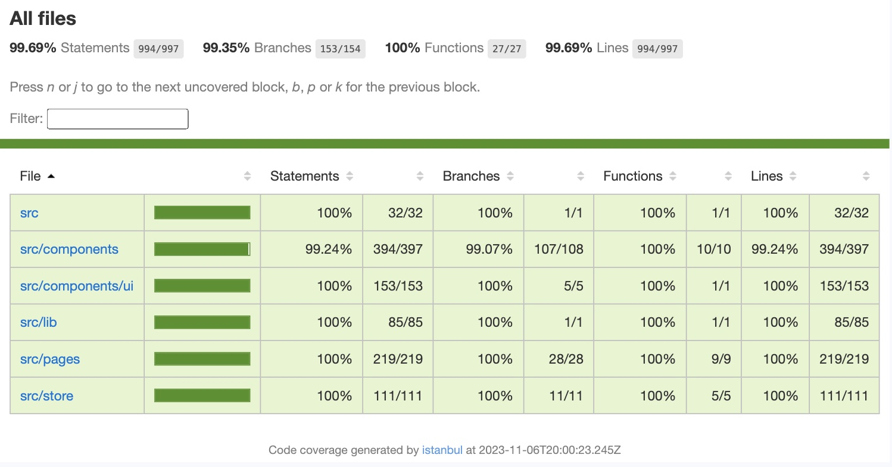
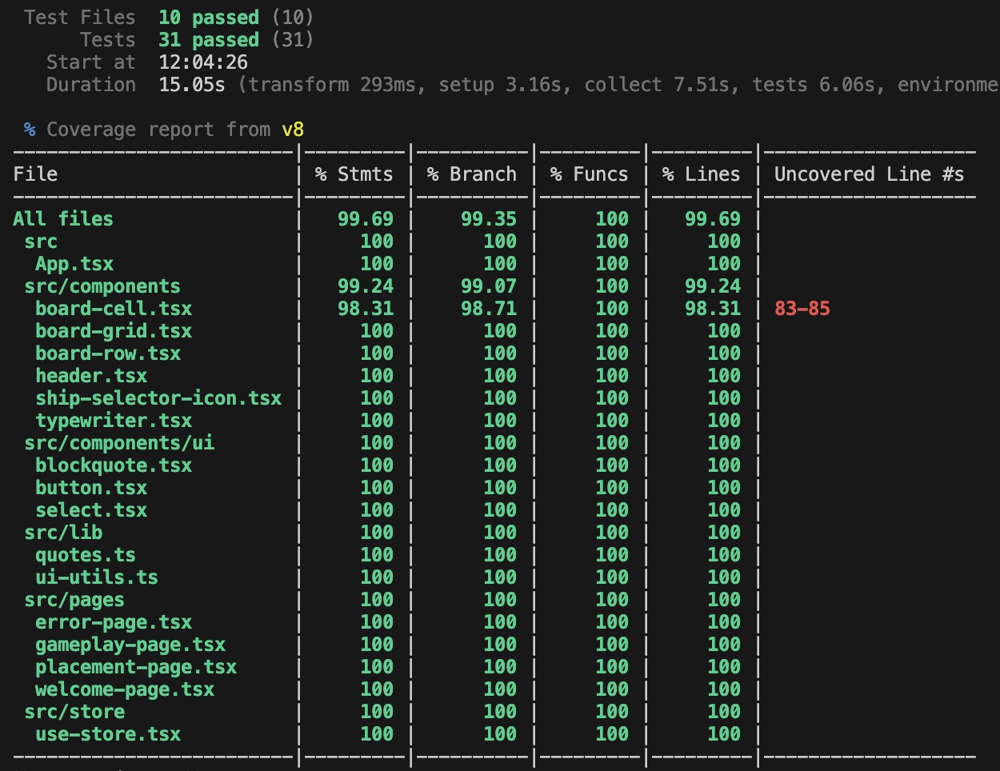

<h1 align="center"> Battleship </h1>

The main purpose of this project is to explore testing in React while creating a Battleship game. I aim to achieve 100% test coverage by the end of development. I'm using `Vitest` as the unit testing framework, `JSDOM` as the running environment for the tests, and a combination of `@testing-library/react` and `@testing-library/jest-dom` for react testing utilities.

In addition, I am using `Zustand` for React state management and `TailwindCSS` for styling.

<!--  -->

### Test Coverage

`994 / 997 lines of code tested`

### Roadmap

- [x] App setup, styling, deployment
- [x] TDD setup and Vitest testing config
- [x] Start page
- [x] Ship placement page
- [ ] Game page and gameplay loop
- [ ] Drag and drop for ships during placement
- [ ] Smarter computer player 
- [ ] Enable two players  online gameplay with Socket.io