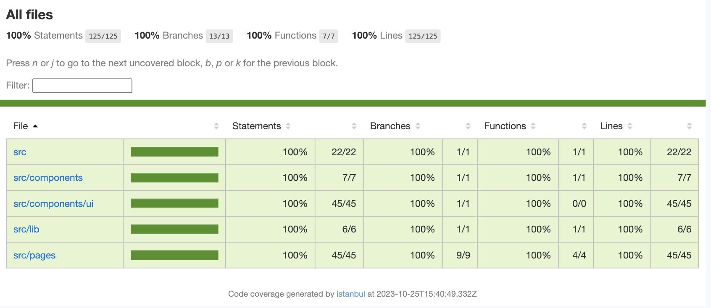
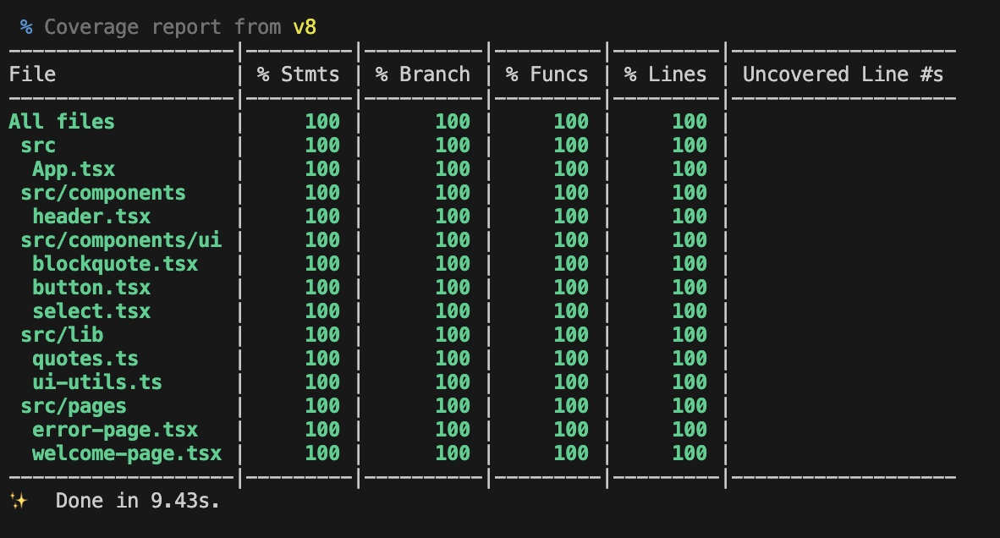

<h1 align="center"> Battleship </h1>

The main purpose of this project is to explore testing in React while creating a Battleship game. I aim to maintain 100% test coverage throughout development. I'm using `Vitest` as the unit testing framework, `JSDOM` as the running environment for the tests, and a combination of `@testing-library/react` and `@testing-library/jest-dom` for react testing utilities.

<!--  -->

### Test Coverage

### Tech Stack 

`React`, `Vite`, `TypeScript`, `TailwindCSS`, `Vitest`, `React-testing-library`

### Roadmap

- [x] React app configuration
- [x] Tailwind configuration
- [x] Testing with Vitest/ TDD setup
- [x] UI configuration - clsx, twMerge, cva, lucide icons
- [x] Deployment to Vercel 
- [x] Welcome page
- [ ] Ship placement page
- [ ] Game page
- [ ] Main game loop
- [ ] Drag and drop for ships during game setup
- [ ] Smarter computer player 
- [ ] Enable two players local co-op 
- [ ] Enable two players  online gameplay